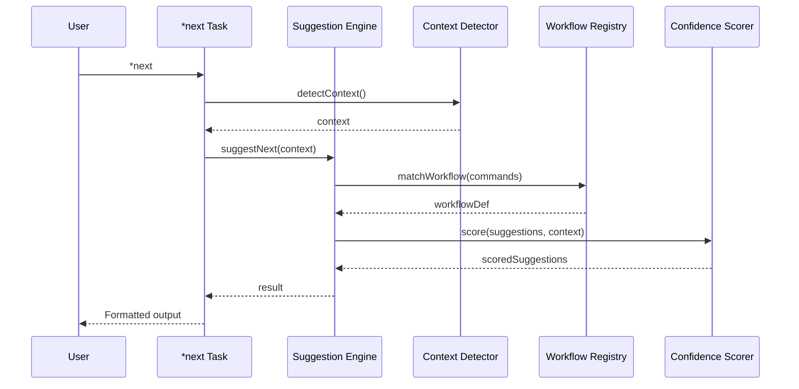

# Story WIS-3: `*next` Task Implementation

<!-- Source: Epic WIS - Workflow Intelligence System -->
<!-- Context: Core WIS functionality - suggest next commands -->
<!-- Created: 2025-12-23 by @sm (River) -->

## Status: Draft

**Priority:** 🟡 MEDIUM
**Sprint:** 10
**Effort:** 11h
**Lead:** @dev (Dex)
**Blocked By:** WIS-2 (Workflow Registry)

---

## Story

**As an** AIOS user,
**I want** a `*next` task that suggests my next commands based on current context,
**So that** I can navigate workflows efficiently without memorizing command sequences.

---

## Background

WIS-1 investigation revealed:
- WorkflowNavigator prototype already generates suggestions
- GreetingBuilder integrates workflow context
- Session state tracks command history and agent sequence
- 75% of infrastructure exists

This story creates the user-facing `*next` task that leverages WIS-2's registry and scoring.

### User Value

```
Before: User finishes a task, wonders "what's next?"
After:  User runs *next, gets context-aware suggestions with confidence scores
```

---

## 🤖 CodeRabbit Integration

### Story Type Analysis

**Primary Type**: Implementation
**Secondary Type(s)**: CLI Development, Integration
**Complexity**: Medium

### Specialized Agent Assignment

**Primary Agents**:
- @dev (Dex): Implement `*next` task and integration

**Supporting Agents**:
- @qa (Quinn): Test suggestion accuracy and edge cases
- @architect (Aria): Ensure integration matches ADR-WIS-001

### Quality Gate Tasks

- [ ] Pre-Commit (@dev): Verify task implementation
  - **Pass criteria:** All ACs met, tests pass, latency <100ms
  - **Fail criteria:** Missing features, broken integration, slow response
- [ ] Pre-PR (@qa): Validate suggestion accuracy
  - **Pass criteria:** 85% accuracy on test scenarios, edge cases handled
  - **Fail criteria:** Low accuracy, crashes, unclear output

### Self-Healing Configuration

**Mode:** light (Primary Agent: @dev)
**Max Iterations:** 2
**Time Limit:** 15 minutes
**Severity Threshold:** CRITICAL only

| Severity | Auto-Fix | Behavior |
|----------|----------|----------|
| CRITICAL | Yes | Block merge, auto-fix if possible |
| HIGH | No | Report only |
| MEDIUM | No | Report only |
| LOW | No | Ignore |

### Focus Areas

- CLI output formatting correctness
- Suggestion engine performance (<100ms)
- Context detection accuracy
- Task completion hook integration

---

## Acceptance Criteria

### AC 3.1: `*next` Task Definition

- [ ] Create task file at `.aios-core/development/tasks/next.md`
- [ ] Task accepts optional arguments:
  - `--story <path>`: Explicit story context
  - `--all`: Show all suggestions (not just top 3)
  - `--help`: Show usage documentation
- [ ] Task integrates with SuggestionEngine from WIS-2

**Task Definition Structure:**
```yaml
name: next
description: Suggest next commands based on current workflow context
args:
  - name: story
    type: path
    optional: true
    description: Explicit story path for context
  - name: all
    type: flag
    optional: true
    description: Show all suggestions instead of top 3
  - name: help
    type: flag
    optional: true
    description: Show usage documentation
```

### AC 3.2: Suggestion Engine Integration

- [ ] Create `suggestion-engine.js` in `.aios-core/workflow-intelligence/engine/`
- [ ] Integrate with:
  - WorkflowRegistry (from WIS-2)
  - ConfidenceScorer (from WIS-2)
  - ContextDetector (existing)
- [ ] Implement `suggestNext(context)` method returning scored suggestions

**API Contract:**
```javascript
// Input
const context = {
  agentId: 'dev',
  lastCommands: ['develop'],
  storyPath: 'docs/stories/v2.1/sprint-10/story-wis-3.md',
  branch: 'feature/wis-3',
  projectState: { modifiedFiles: ['src/index.js'], testsPassing: true }
};

// Output
const result = {
  workflow: 'story_development',
  currentState: 'in_development',
  confidence: 0.92,
  suggestions: [
    { command: '*review-qa', args: '${story_path}', description: 'Run QA review', confidence: 0.95, priority: 1 },
    { command: '*run-tests', args: '', description: 'Execute test suite', confidence: 0.80, priority: 2 }
  ]
};
```

### AC 3.3: Task Completion Hook

- [ ] Enhance `context-loader.js` with task completion tracking
- [ ] Implement `onTaskComplete(taskName, result)` method
- [ ] Update session state with:
  - Last command executed
  - Workflow state transition
  - Timestamp
- [ ] Hook integrates with existing task execution flow

### AC 3.4: Formatted CLI Output

- [ ] Suggestions displayed with clear formatting:
  ```
  🧭 Workflow: story_development
  📍 State: in_development (confidence: 92%)

  Next steps:
  1. `*review-qa docs/stories/v2.1/sprint-10/story-wis-3.md` - Run QA review
  2. `*run-tests` - Execute test suite manually
  3. `*pre-push-quality-gate` - Final quality checks

  Type a number to execute, or press Enter to continue manually.
  ```
- [ ] Low-confidence suggestions (<50%) marked as "uncertain"
- [ ] Colors used for visual hierarchy (if terminal supports)

### AC 3.5: Context Override

- [ ] `--story` flag sets explicit story context
- [ ] Story path validated before use
- [ ] Override context merged with auto-detected context
- [ ] Clear feedback when using override

### AC 3.6: Help Integration

- [ ] `*next --help` displays usage documentation
- [ ] Help includes examples:
  ```
  Usage: *next [options]

  Suggests next commands based on current workflow context.

  Options:
    --story <path>  Explicit story path for context
    --all           Show all suggestions (not just top 3)
    --help          Show this help message

  Examples:
    *next                                    # Auto-detect context
    *next --story docs/stories/v2.1/sprint-10/story-wis-3.md
    *next --all                              # Show all suggestions
  ```

### AC 3.7: Performance

- [ ] Suggestion latency <100ms (measured)
- [ ] Caching utilized for workflow patterns (5-minute TTL)
- [ ] Lazy loading of WIS modules
- [ ] Performance test included

### AC 3.8: Testing

- [ ] Unit tests for SuggestionEngine
- [ ] Integration tests for full flow
- [ ] Test scenarios:
  - New session (no history)
  - Mid-workflow (clear context)
  - Ambiguous context (multiple matches)
  - No matching workflow
- [ ] Performance test: measure latency

---

## Technical Design

### Component Integration



### Directory Structure

```
.aios-core/
├── workflow-intelligence/
│   ├── engine/
│   │   ├── suggestion-engine.js    # NEW - Core engine
│   │   └── confidence-scorer.js    # From WIS-2
│   ├── registry/
│   │   └── workflow-registry.js    # From WIS-2
│   └── index.js                    # Public API
│
├── core/session/
│   └── context-loader.js           # ENHANCED with task hook
│
└── development/tasks/
    └── next.md                     # NEW - Task definition
```

---

## Dependencies

### Blocked By
- **WIS-2:** Workflow Registry Enhancement (needs registry and scoring)

### Blocks
- **WIS-4:** Wave Analysis Engine (extends suggestions with wave info)
- **WIS-5:** Pattern Capture (captures usage of *next)

---

## Success Criteria

1. `*next` returns context-aware suggestions
2. Suggestion latency <100ms
3. 85% suggestion accuracy on test scenarios
4. Help documentation accessible
5. Existing functionality unaffected
6. All tests pass

---

## File List

| File | Status | Description |
|------|--------|-------------|
| `docs/stories/v2.1/sprint-10/story-wis-3-next-task.md` | Draft | This story |
| `.aios-core/development/tasks/next.md` | To Create | Task definition |
| `.aios-core/workflow-intelligence/engine/suggestion-engine.js` | To Create | Core suggestion engine |
| `.aios-core/core/session/context-loader.js` | To Modify | Add task completion hook |

---

## Change Log

| Version | Date | Author | Changes |
|---------|------|--------|---------|
| 1.0 | 2025-12-23 | @sm (River) | Initial draft from MVP scope |
