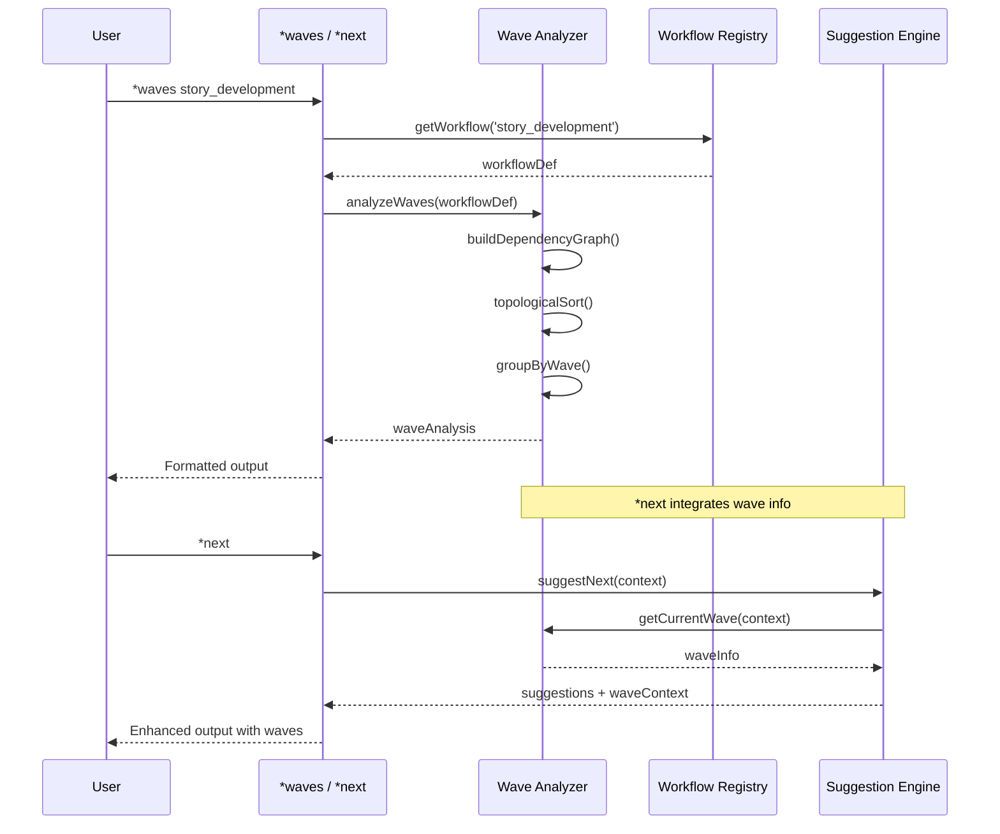

# Story WIS-4: Wave Analysis Engine

<!-- Source: Epic WIS - Workflow Intelligence System -->
<!-- Context: Parallel execution detection and optimization -->
<!-- Created: 2025-12-25 by @po (Pax) -->

## Status: Draft

**Priority:** 🟡 MEDIUM
**Sprint:** 11
**Effort:** 8h
**Lead:** @dev (Dex)

---

## Story

**As an** AIOS user executing multi-step workflows,
**I want** the system to detect which tasks can run in parallel (waves),
**So that** I can optimize my workflow execution time and understand task dependencies.

---

## Background

WIS-9 Investigation defined the Wave Analysis concept (Section 4.3):
- Waves are groups of tasks that can execute in parallel
- Each wave completes before the next begins
- Dependencies determine wave boundaries
- Parallel execution can reduce total workflow time by 40-60%

### User Value

```
Before: User runs tasks sequentially, not knowing which can run in parallel
After:  System shows "Wave 1: task-a, task-b (parallel) → Wave 2: task-c (depends on a,b)"
```

### Reference Documents

| Document | Section |
|----------|---------|
| `docs/architecture/wis-9-investigation-report.md` | Section 4.3: Wave Analysis |
| Epic WIS Index | Technical Architecture - wave-analyzer.js |
| WIS-2 | Provides WorkflowRegistry with dependency data |
| WIS-3 | Provides SuggestionEngine integration point |

---

## 🤖 CodeRabbit Integration

### Story Type Analysis

**Primary Type**: Implementation
**Secondary Type(s)**: Algorithm Development, Integration
**Complexity**: Medium

### Specialized Agent Assignment

**Primary Agents**:
- @dev (Dex): Implement Wave Analysis Engine

**Supporting Agents**:
- @qa (Quinn): Test wave detection accuracy
- @architect (Aria): Validate dependency graph algorithm

### Quality Gate Tasks

- [ ] Pre-Commit (@dev): Verify wave detection implementation
  - **Pass criteria:** All ACs met, tests pass, correct wave grouping
  - **Fail criteria:** Incorrect dependencies, missing parallel detection
- [ ] Pre-PR (@qa): Validate wave analysis accuracy
  - **Pass criteria:** 90% accuracy on test workflows, edge cases handled
  - **Fail criteria:** Incorrect wave boundaries, circular dependency crashes

### Self-Healing Configuration

**Mode:** light (Primary Agent: @dev)
**Max Iterations:** 2
**Time Limit:** 15 minutes
**Severity Threshold:** CRITICAL only

| Severity | Auto-Fix | Behavior |
|----------|----------|----------|
| CRITICAL | Yes | Block merge, auto-fix if possible |
| HIGH | No | Report only |
| MEDIUM | No | Report only |
| LOW | No | Ignore |

### Focus Areas

- Dependency graph correctness
- Wave grouping algorithm
- Circular dependency detection
- Integration with WIS-3 `*next` output

---

## Acceptance Criteria

### AC 4.1: Wave Analyzer Module

- [ ] Create `wave-analyzer.js` in `.aios-core/workflow-intelligence/engine/`
- [ ] Implement dependency graph builder from workflow registry
- [ ] Implement topological sort for wave ordering
- [ ] Detect circular dependencies and report errors
- [ ] Export `analyzeWaves(workflowId)` method

**API Contract:**
```javascript
// Input
const workflowId = 'story_development';

// Output
const result = {
  workflowId: 'story_development',
  totalTasks: 6,
  waves: [
    {
      waveNumber: 1,
      tasks: ['read-story', 'setup-branch'],
      parallel: true,
      estimatedDuration: '5min'
    },
    {
      waveNumber: 2,
      tasks: ['implement'],
      parallel: false,
      dependsOn: ['read-story', 'setup-branch'],
      estimatedDuration: '30min'
    },
    {
      waveNumber: 3,
      tasks: ['write-tests', 'update-docs'],
      parallel: true,
      dependsOn: ['implement'],
      estimatedDuration: '15min'
    },
    {
      waveNumber: 4,
      tasks: ['run-tests'],
      parallel: false,
      dependsOn: ['write-tests'],
      estimatedDuration: '5min'
    }
  ],
  optimizationGain: '35%',  // Time saved vs sequential
  criticalPath: ['read-story', 'implement', 'write-tests', 'run-tests']
};
```

### AC 4.2: Dependency Graph Builder

- [ ] Parse workflow definitions from WorkflowRegistry
- [ ] Build directed acyclic graph (DAG) of task dependencies
- [ ] Handle implicit dependencies (task order in workflow)
- [ ] Handle explicit dependencies (`dependsOn` field)
- [ ] Validate graph has no cycles

**Data Structure:**
```javascript
const graph = {
  nodes: ['task-a', 'task-b', 'task-c', 'task-d'],
  edges: [
    { from: 'task-a', to: 'task-c' },
    { from: 'task-b', to: 'task-c' },
    { from: 'task-c', to: 'task-d' }
  ]
};
```

### AC 4.3: Wave Grouping Algorithm

- [ ] Implement Kahn's algorithm for topological sorting
- [ ] Group tasks by dependency level (wave number)
- [ ] Tasks with same level can run in parallel
- [ ] Calculate estimated duration per wave
- [ ] Calculate total optimization gain

### AC 4.4: Integration with `*next`

- [ ] Extend `*next` output to show wave context
- [ ] Show which tasks can run in parallel
- [ ] Indicate current wave position in workflow
- [ ] Format output with wave visualization

**Enhanced `*next` Output:**
```
🧭 Workflow: story_development
📍 State: in_development (Wave 2 of 4)

Current Wave (parallel):
  ├─ `*write-tests` - Write unit tests ⏳
  └─ `*update-docs` - Update documentation ⏳

Next Wave (after current completes):
  └─ `*run-tests` - Execute test suite

💡 Tip: Run both current wave tasks in parallel to save ~15min
```

### AC 4.5: CLI Command `*waves`

- [ ] Create task file at `.aios-core/development/tasks/waves.md`
- [ ] Command shows full wave analysis for current workflow
- [ ] Arguments:
  - `--workflow <name>`: Analyze specific workflow
  - `--visual`: ASCII visualization of waves
  - `--json`: Output as JSON
- [ ] Add command to @dev agent

**Visual Output Example:**
```
Wave Analysis: story_development
════════════════════════════════════════

Wave 1 ──┬── read-story (5min)
         └── setup-branch (2min)
              │
Wave 2 ──────── implement (30min)
              │
Wave 3 ──┬── write-tests (10min)
         └── update-docs (5min)
              │
Wave 4 ──────── run-tests (5min)

Total Sequential: 57min
Total Parallel:   42min
Optimization:     26% faster

Critical Path: read-story → implement → write-tests → run-tests
```

### AC 4.6: Circular Dependency Detection

- [ ] Detect cycles in dependency graph
- [ ] Report clear error message with cycle path
- [ ] Suggest resolution (which dependency to remove)
- [ ] Never hang or infinite loop

**Error Output:**
```
❌ Circular Dependency Detected!

Cycle: task-a → task-b → task-c → task-a

Suggestion: Remove dependency from task-c to task-a
```

### AC 4.7: Testing

- [ ] Unit tests for wave-analyzer.js
- [ ] Unit tests for dependency graph builder
- [ ] Integration tests with WorkflowRegistry
- [ ] Test scenarios:
  - Simple linear workflow
  - Fully parallel workflow
  - Diamond dependency pattern
  - Circular dependency (should error)
  - Empty workflow
  - Single task workflow

---

## Technical Design

### Component Integration



### Directory Structure

```
.aios-core/
├── workflow-intelligence/
│   ├── engine/
│   │   ├── suggestion-engine.js    # From WIS-3
│   │   ├── confidence-scorer.js    # From WIS-2
│   │   └── wave-analyzer.js        # NEW - This story
│   ├── registry/
│   │   └── workflow-registry.js    # From WIS-2
│   └── index.js                    # Public API (add wave exports)
│
└── development/tasks/
    └── waves.md                    # NEW - Task definition
```

### Algorithm: Kahn's Topological Sort

```javascript
function analyzeWaves(workflow) {
  const graph = buildDependencyGraph(workflow);

  // Check for cycles
  if (hasCycle(graph)) {
    throw new CircularDependencyError(findCycle(graph));
  }

  // Kahn's algorithm
  const inDegree = calculateInDegrees(graph);
  const waves = [];
  let remaining = new Set(graph.nodes);

  while (remaining.size > 0) {
    // Find all nodes with no incoming edges
    const wave = [...remaining].filter(node => inDegree[node] === 0);

    if (wave.length === 0) {
      throw new Error('Cycle detected'); // Shouldn't happen after check
    }

    waves.push({
      waveNumber: waves.length + 1,
      tasks: wave,
      parallel: wave.length > 1
    });

    // Remove wave nodes and update in-degrees
    for (const node of wave) {
      remaining.delete(node);
      for (const neighbor of graph.edges[node] || []) {
        inDegree[neighbor]--;
      }
    }
  }

  return waves;
}
```

---

## Dependencies

### Blocked By
- **WIS-2:** Workflow Registry ✅ (Done - provides workflow definitions)
- **WIS-3:** `*next` Task (provides integration point) - Can develop in parallel

### Blocks
- **WIS-5:** Pattern Capture (uses wave info for pattern detection)

### Related
- **@dev agent:** Will receive new `*waves` command
- **SuggestionEngine:** Integration for enhanced `*next` output

---

## Success Criteria

1. `*waves` command shows correct wave grouping
2. Parallel tasks correctly identified
3. Circular dependencies detected and reported
4. `*next` output enhanced with wave context
5. All unit tests pass
6. Algorithm performance <50ms for workflows up to 50 tasks

---

## Non-Functional Requirements (NFR)

### Performance
| Metric | Target |
|--------|--------|
| Wave analysis latency | <50ms |
| Graph building | <20ms |
| Memory usage | <5MB for large workflows |

### Reliability
- [ ] No crashes on malformed workflows
- [ ] Graceful handling of missing dependencies
- [ ] Clear error messages for invalid inputs

### Maintainability
- [ ] Well-documented algorithm with comments
- [ ] Modular design (graph builder, sorter, formatter separate)
- [ ] Extensible for future optimizations

### Security
- [ ] No arbitrary code execution from workflow definitions
- [ ] Sanitize workflow IDs before use
- [ ] Limit recursion depth for cycle detection

---

## Testing

**Test Location:** `tests/unit/workflow-intelligence/wave-analyzer.test.js`

**Validation:**
1. Run unit tests: `npm test -- wave-analyzer`
2. Run integration tests: `npm test -- wis-integration`

**Test Scenarios:**

| Scenario | Input | Expected Output |
|----------|-------|-----------------|
| Linear workflow | A→B→C→D | 4 waves, no parallelization |
| Parallel start | A,B→C | Wave 1: [A,B], Wave 2: [C] |
| Diamond pattern | A→B,C→D | Wave 1: [A], Wave 2: [B,C], Wave 3: [D] |
| Full parallel | A,B,C,D (no deps) | Wave 1: [A,B,C,D] |
| Circular | A→B→C→A | Error: Circular dependency |
| Empty workflow | [] | Empty waves array |
| Single task | [A] | Wave 1: [A] |
| Complex (10 tasks) | Mixed deps | Correct wave grouping |

**Performance Tests:**

| Test | Metric | Target |
|------|--------|--------|
| Small workflow (5 tasks) | Analysis time | <10ms |
| Medium workflow (20 tasks) | Analysis time | <30ms |
| Large workflow (50 tasks) | Analysis time | <50ms |

---

## File List

| File | Status | Description |
|------|--------|-------------|
| `docs/stories/v2.1/sprint-11/story-wis-4-wave-analysis.md` | Draft | This story |
| `.aios-core/workflow-intelligence/engine/wave-analyzer.js` | To Create | Core wave analysis engine |
| `.aios-core/development/tasks/waves.md` | To Create | Task definition |
| `.aios-core/workflow-intelligence/index.js` | To Modify | Add wave exports |
| `tests/unit/workflow-intelligence/wave-analyzer.test.js` | To Create | Unit tests |

---

## Tasks / Subtasks

- [ ] **Task 1: Create Wave Analyzer Module** (AC: 4.1)
  - [ ] Create `wave-analyzer.js`
  - [ ] Implement `analyzeWaves(workflowId)` method
  - [ ] Export public API

- [ ] **Task 2: Implement Dependency Graph Builder** (AC: 4.2)
  - [ ] Parse workflow definitions
  - [ ] Build directed acyclic graph (DAG)
  - [ ] Handle implicit and explicit dependencies

- [ ] **Task 3: Implement Wave Grouping Algorithm** (AC: 4.3)
  - [ ] Implement Kahn's topological sort
  - [ ] Group tasks by dependency level
  - [ ] Calculate optimization metrics

- [ ] **Task 4: Integrate with `*next`** (AC: 4.4)
  - [ ] Extend SuggestionEngine output
  - [ ] Add wave context to suggestions
  - [ ] Format enhanced output

- [ ] **Task 5: Create `*waves` Command** (AC: 4.5)
  - [ ] Create task definition file
  - [ ] Implement visual output
  - [ ] Add to @dev agent commands

- [ ] **Task 6: Circular Dependency Detection** (AC: 4.6)
  - [ ] Implement cycle detection algorithm
  - [ ] Format error messages
  - [ ] Suggest resolution

- [ ] **Task 7: Testing** (AC: 4.7)
  - [ ] Write unit tests
  - [ ] Write integration tests
  - [ ] Write performance tests

---

## Dev Agent Record

### Agent Model Used
*(To be filled by @dev)*

### Debug Log References
*(To be filled during development)*

### Completion Notes
*(To be filled after implementation)*

---

## Change Log

| Version | Date | Author | Changes |
|---------|------|--------|---------|
| 1.0 | 2025-12-25 | @po (Pax) | Initial draft with full specification |
